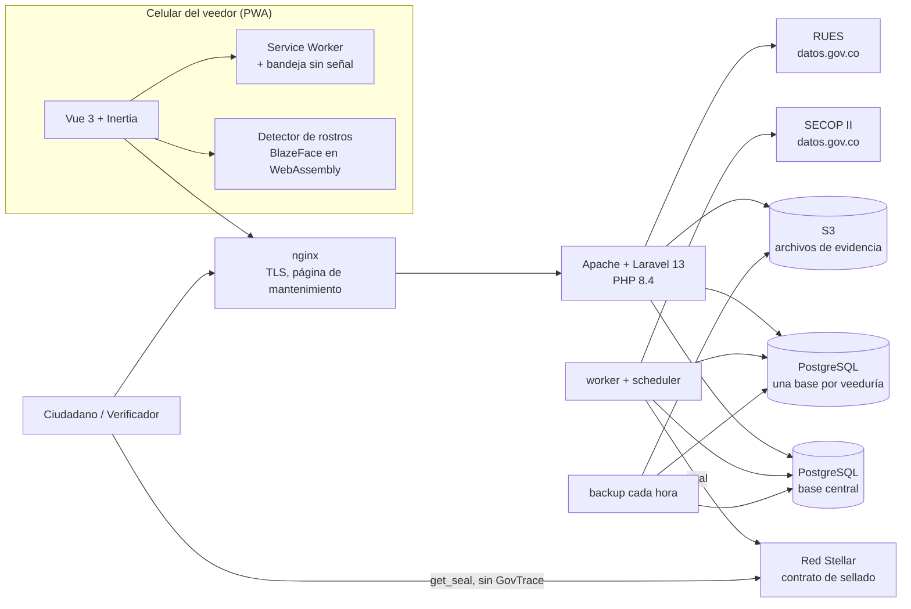
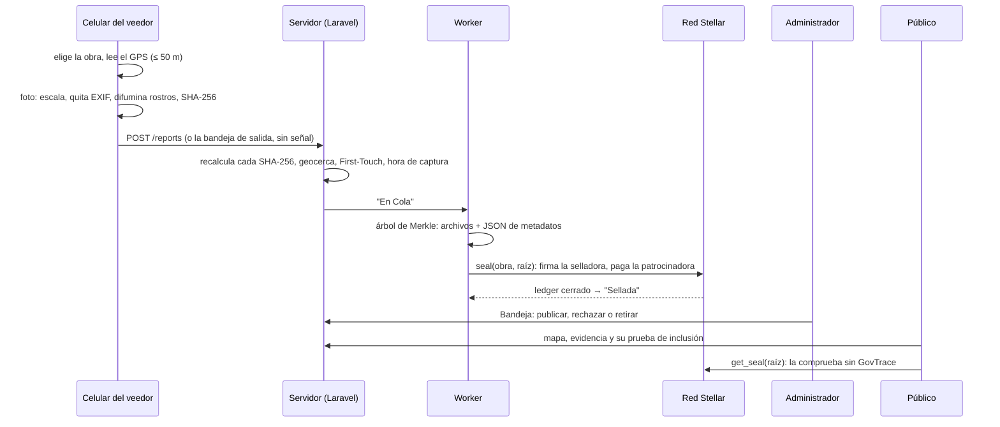

# Cómo está construido GovTrace

Esta guía recorre el proyecto entero. Sirve para quien llega por primera vez, sea contribuyente, auditor o jurado. Explica:

- qué hay en cada carpeta;
- cómo viaja un reporte desde el celular del veedor hasta la red Stellar;
- qué guarda cada base de datos;
- cómo se prueba y cómo se despliega.

Los detalles de cada regla están en `specs/`; aquí está el mapa para encontrarlos.

**En cifras (2026-10-10):**

| | |
|---|---|
| Historias de usuario | 67, cada una con su `.feature` |
| Escenarios Gherkin | 432, cada uno con una prueba que lleva su nombre (`make trace-check`) |
| Código | ~17 400 líneas de PHP en `app/` y ~8 300 de Vue y JavaScript |
| Pruebas | ~19 500 líneas de PHP y ~8 500 de JavaScript |
| Iteraciones | 41 en `specs/PLAN.md`, varias con partes a, b, c… |

## 1. Qué hace, y para quién

GovTrace es una plataforma de código abierto para que las **veedurías ciudadanas** de Colombia recojan evidencia de las obras públicas. Esa evidencia (fotos y PDF) queda **sellada en la red Stellar**: cualquiera puede comprobar después que un archivo no cambió, sin confiar en GovTrace.

| Rol | Dónde vive | Qué hace |
|---|---|---|
| **Super Administrador** | Dominio central (`govtrace…`) | Da de alta las veedurías, ajusta los parámetros, vigila el sellado, los costos y la salud de SECOP. |
| **Administrador de Organización** | El subdominio de su veeduría | Invita veedores y define el territorio. Revisa la Bandeja: publica, rechaza o retira cada evidencia. Arma el expediente de una obra. |
| **Veedor** | La app de su veeduría, en el celular (PWA) | Elige la obra, toma la foto en el lugar y la envía. Sin señal, la guarda y la envía al volver la señal. |
| **Ciudadano o Verificador** | Público, sin cuenta | Ve el mapa de obras, comprueba una evidencia con el validador o con `tools/verify`, e informa a la veeduría. |

El detalle por rol está en [`docs/funciones-por-rol.md`](funciones-por-rol.md).

## 2. El repositorio, carpeta por carpeta

```
app/                  Backend Laravel, en capas (DDD adaptado a Laravel)
  Domain/             Entidades, reglas e invariantes: no saben de HTTP
  Application/        Casos de uso: lo que pide una pantalla o un trabajo
  Infrastructure/     Lo de afuera: Stellar, SECOP, RUES, correo, tenancy
  Http/               Controladores (Central/ y Tenant/), middleware
  Jobs/               Trabajos en cola y programados (sellar, sincronizar, purgar)
  Console/Commands/   make admin, make demo, make invites…
bootstrap/app.php     Middleware y manejo de errores (404 de una organización que no existe)
config/               tenancy.php, stellar.php, filesystems.php ("evidencias" en S3)…
contracts/sealing/    El contrato inteligente, en Rust (Soroban), con sus pruebas
database/migrations/  Las del dominio central (35) y, en tenant/, las de cada organización (27)
deploy/               Producción y staging: deploy.sh, certificado, AWS (CloudFormation)
docker/               Imágenes y configuración: app, proxy (nginx), pgsql, backup, soroban, demo
docs/                 Guías: esta, sellado, staging, salida a producción, restauración, UX…
features/             Gherkin en español: uno por historia (el entregable del discovery)
lang/                 Textos de Laravel en español
ops/monitoring/       Monitor externo (Gatus), en otra máquina
public/               index.php, sw.js (Service Worker), build/ (lo que genera Vite)
resources/js/         Frontend Vue 3 + Inertia: Pages/, Components/, Layouts/, lib/, composables/
routes/               web.php (central), tenant.php (cada organización), console.php (calendario)
sessions/             Bitácora de las sesiones de discovery (BDD 2.0)
specs/                SPEC.md, PLAN.md, historias/, criterios/*.yaml, epicas/, AUDIT.md
tests/                Feature/ y Unit/ (Pest), e2e/ y ux/ (Playwright), infra/ (scripts de chequeo)
tools/verify/         El verificador independiente: Node, sin dependencias
Makefile              Todo se corre con make (make help lista 65 comandos)
Jenkinsfile           El pipeline de cada PR
```

## 3. La arquitectura en una imagen



Los servicios de Docker (`docker-compose.yml`) son:

- **De base:** `app` (Apache + PHP 8.4), `proxy` (nginx, la única entrada), `worker` (la cola), `scheduler` (el calendario), `pgsql`, `storage` (un S3 de desarrollo) y `backup`.
- **Perfiles opcionales:** `stellar` y `soroban` (la red local y las herramientas del contrato), `frontend` (Node), `tools` (Adminer) y `async` (Redis).
- **En producción** (`docker-compose.prod.yml`): la imagen inmutable, TLS con un certificado comodín, `certbot` y un S3 real.

## 4. Una veeduría, una base de datos (multi-tenant)

Cada veeduría es un **tenant** de Stancl Tenancy, con su **propia base de PostgreSQL** (`PostgreSQLDatabaseManager`, prefijo `tenant`) y su **subdominio** (`<slug>.govtrace…`). El modelo es `app/Infrastructure/Tenancy/Tenant.php`.

| Base central (`database/migrations/`) | Base de cada veeduría (`database/migrations/tenant/`) |
|---|---|
| Veedurías (`tenants`, `domains`) y sus territorios | Sus usuarios (Administrador y Veedor), con roles de Spatie |
| Super Administradores (`users`), parámetros con historial | Fichas de obra (`worksites`) y su relación con contratos |
| Contratos de SECOP II (compartidos por todos) y su archivo | Reportes, evidencias y sus sellos (`report_seals`) |
| Departamentos y municipios (DIVIPOLA) | Seudónimos de veedores, informes de ciudadanos |
| Log de auditoría, turno de la selladora, solicitudes de alta | Autorizaciones al Super Administrador (30 días) |

Reglas que conviene saber:

- **Una sesión vale solo en el subdominio donde se abrió.** Los usuarios viven en la base de cada veeduría, así que la misma cookie en otro subdominio sería otra persona.
- Un subdominio que no existe responde **404**, no 500 (`bootstrap/app.php`).
- Lo que comparten todas las veedurías vive en la base central: los contratos, los parámetros, el turno de la selladora.
- **No uses la caché para candados globales:** dentro de una veeduría, la caché lleva su prefijo (`TenantCacheBootstrapper`).

## 5. El backend, por capas

### Domain (`app/Domain`): las reglas

| Módulo | Qué contiene (clases principales) |
|---|---|
| `Reports` | `Report`, `Evidence`, `EvidenceSet` (de 1 a 5 fotos o un PDF), `Geofence` (radio vigente al capturar), `SuspiciousCaptureTime` (R-SEC-05), `GpsReading`, `EditorialStatus` (Oculta → Publicada → Retirada, o Rechazada), `Blurring`, `JpegMetadata` |
| `Sealing` | `MerkleTree`, `SealedMetadata` (el JSON canónico que también se sella), `VeedorPseudonym` (HMAC, nunca el ID), `SealStatus`, `ReportSeal`, `SealingRetryPolicy`, `SealingPause`, `Xlm` |
| `Worksites` | `Worksite`, `WorksiteContract`, `FirstTouch` (la primera ubicación, con guardas), `PinColor`, `PendingLocation` |
| `Contracts` | `Contract` (SECOP II), `SecopContractStatus`, `WorkType` (tipo de obra), `SearchText` (búsqueda sin tildes), `ContractArchive` |
| `Organization` | `Nit`, `Subdomain`, `Roles`, `WatchedTerritories`, `InvitationToken`, `OrganizationStatus`, `SvgSanitizer` (logos), `SuperAdminAuthorization` |
| `Geography` | `GeoPoint` (distancias), `Municipality`, `Department`, `MunicipalityMatcher`, `PlaceName` |
| `Configuration` | `Parameters` (nunca se edita una fila: se agrega una versión con su fecha, R-AUD-05), `ConfigurableParameter`, `FixedParameters` |
| `Audit`, `CitizenReports`, `Shared` | `AuditLog`; `CitizenReport` y su código por correo; `PublicId` (ULID en las URL, nunca el número interno) |

### Application (`app/Application`): los casos de uso

Cada clase hace una cosa que pide una pantalla o un trabajo:

- **Reports:** `CreateReport` (el corazón, sección 6), `NearbyWorksites` y `CreateReportOnBehalf`, cuando el Super Administrador tiene autorización.
- **Sealing:** `PrepareReportSeal`, `QueueReportForSealing`, `SealReceipt`, `SealingCosts`, `ContractLifetime` y `SuperAdminAlerts`.
- **Publication:** `EditorialDecisions` (la Bandeja), `PublicMap`, `PublicWorksiteView`, `PublicTimeline`, `InclusionProof`, `StellarForBrowser`, `OpenData` y `PublicStats`.
- **Contracts:** `ProcessSecopContractRow`, `BrowseReportableContracts` (la lista del veedor, it. 47), `SearchSelectableContracts` y `SecopHealth`.
- **Organization**, con 29 casos: registrar, invitar, aceptar, desactivar, dar de baja y reactivar una veeduría, el territorio, el perfil y la consulta al RUES.
- **Otros módulos:** `Dossier` (el expediente para la Contraloría), `CitizenReports`, `Auth` (inicio de sesión con bloqueo y 2FA del Super Administrador), `Privacy` y `Demo`.

### Infrastructure (`app/Infrastructure`): lo de afuera

| Clase | Qué hace |
|---|---|
| `Stellar/StellarSealingNetwork` | Invoca `seal(obra, raíz)` del contrato. Firma la selladora y paga la patrocinadora (fee bump). |
| `Stellar/SealerTurn` | Stellar admite una sola transacción pendiente por cuenta, así que la selladora sella por turnos, guardados en la base central. |
| `Stellar/StellarRpc`, `SendRefusal`, `MainnetConfiguration` | El RPC, los rechazos con su código y las guardas de la red principal. |
| `Secop/SecopClient` | SECOP II en datos.gov.co (`jbjy-vk9h`). |
| `Rues/RuesClient` | El RUES (`c82u-588k`), para la validación asistida de una veeduría. |
| `Tenancy/*`, `Mail/*`, `Notifications/WebhookChannel`, `Scheduling/NightlySchedule` | Tenancy, la copia de cada correo a Mailpit, los avisos por webhook y el calendario nocturno. |

### Http (`app/Http`)

- **Controladores:** en `Central/` están los del Super Administrador (15) y en `Tenant/` los de cada veeduría (33, públicos y con sesión).
- **Middleware:**
  - `SecurityHeaders`: CSP, HSTS y Referrer-Policy;
  - `EnsureAccountIsUsable`: cierra la sesión de una cuenta desactivada o de una veeduría suspendida;
  - `EnsureImpedimentsDeclared`: el veedor declara sus impedimentos antes de reportar;
  - `EnsureMapIsOnline`: el mapa sale de línea con la baja de la veeduría;
  - `EnsureTwoFactorPassed`;
  - `HandleInertiaRequests`.
- **Rutas:** `routes/web.php` (unas 65, solo en los dominios centrales) y `routes/tenant.php` (unas 90), agrupadas así:
  - lo público, con límite por visitante;
  - la sesión de la veeduría;
  - solo el Administrador;
  - solo el Veedor.

### Trabajos y calendario (`app/Jobs`, `routes/console.php`)

| Trabajo | Cuándo | Qué hace |
|---|---|---|
| `SealReport` → `ConfirmSeal` | Al recibir un reporte | Sella y confirma. Reintenta a 1 min, 5 min, 15 min y 1 h, y al quinto intento queda "Falla de Sellado". |
| `SyncSecopContracts` | De noche, a la hora del parámetro, y al dar de alta una veeduría | Trae los contratos del territorio vigilado. |
| `CalculateWorksitesAtRisk` | Una hora después de la sincronización | Marca "en riesgo" una obra vencida que SECOP sigue mostrando en ejecución. |
| `CheckSealingQueue`, `CheckSponsorBalance` | Cada 15 min | Avisa si hay evidencias sin sellar por más de 2 h, o si a la patrocinadora le falta XLM. |
| `CheckContractLifetime` | 07:00 | Avisa si se acerca el vencimiento del contrato en la red. |
| `SendReviewDigests`, `CheckOrganizationActivity` | 07:00 y 08:00 | Un correo diario a cada Administrador con cuántas evidencias esperan revisión. Un aviso al Super Administrador si una veeduría lleva 30 días sin actividad. |
| `Purge…` (4) y `ArchiveOldContracts` | 01:00–01:30, y el día 1 a las 05:00 | Retención: evidencias de veedurías dadas de baja, seudónimos a los 5 años, informes ciudadanos, solicitudes, y el archivo de contratos viejos. |

## 6. El recorrido de un reporte (el corazón)



### En el celular

Todo esto pasa en `resources/js`:

1. **Elegir la obra** (`WorksiteBrowser`, it. 47):
   - la lista de obras de su municipio, que se deduce del GPS;
   - filtros por tipo, situación y entidad, y búsqueda sin tildes;
   - arriba, las obras cercanas si la lectura es de 50 m o menos.
2. **El GPS** (`composables/useGps.js`):
   - sigue la señal hasta una lectura de 50 m o menos;
   - el reporte usa una de 30 s o menos, con su hora como hora de captura.
3. **La foto** (`lib/evidence/`):
   - `photos.js` la escala a 1920 px y le quita el EXIF;
   - `faces.js` busca los rostros con BlazeFace en WebAssembly (it. 48): la foto entera y una grilla de 4 × 4 ventanas, para encontrar rostros desde unos 48 px;
   - `PhotoReview.vue` muestra la foto ya difuminada, y quien la envía puede difuminar más a mano o quitar un recuadro;
   - solo al aceptarla se codifica el JPEG y se calcula su **SHA-256**.
   - La foto nunca sale del teléfono sin difuminar (R-PRIV-05).
4. **Sin señal** (`lib/outbox.js`, `public/sw.js`):
   - el reporte se guarda en IndexedDB con su lugar y su hora congelados: hasta 10 reportes, 50 MB y 7 días;
   - se envía solo cuando vuelve la señal;
   - el Service Worker guarda las pantallas y los archivos de Vite.
   - Si el servidor se está actualizando (502, 503 o 504), el reporte también queda en la bandeja (it. 42c).

### En el servidor

**Al recibirlo** (`CreateReport`):

- **Huella:** recalcula el SHA-256 de cada archivo y, si no coincide con el del teléfono, no guarda nada (R-HASH-01).
- **Lugar:**
  - **Geocerca:** si la obra ya tiene ubicación, el reporte debe hacerse dentro de su radio. Vale el que regía al capturar (R-AUD-05).
  - **First-Touch:** el primer reporte de una obra sin ubicación la fija solo si se hizo cerca de la cabecera del municipio y con buena señal. Si no, se recibe igual y la ubicación queda por confirmar. Un bloqueo de fila evita que dos veedores la fijen a la vez.
- **Hora:** una hora de captura sospechosa se marca, no se rechaza (R-SEC-05).
- **Resultado:** los archivos se guardan byte a byte en el disco `evidencias` (S3), y el reporte queda "Recibida" → "En Cola".

**El sellado** (`PrepareReportSeal`, `SealReport`, `ConfirmSeal`):

- **Las hojas del árbol de Merkle:** los archivos en orden y, al final, el hash de `SealedMetadata`, el JSON canónico con el contexto. Ese JSON lleva el **seudónimo** del veedor, nunca su ID.
- **La raíz y la obra:** se sella **una sola raíz por reporte**, junto al SHA-256 de «organización:ficha». No va ningún dato legible.
- **Quién firma y quién paga:** firma la **selladora** y paga la **patrocinadora** (fee bump). El veedor no ve nada de Stellar (R-BLK-01).
- **La confirmación:** "Sellada" es estar en un ledger cerrado. En Stellar eso es definitivo, sin confirmaciones extra.
- **Cada archivo** guarda su **prueba de inclusión**: los hermanos en el árbol, de abajo hacia arriba.

**La publicación** (`EditorialDecisions`):

- Toda evidencia nace **Oculta**. Solo el Administrador de su veeduría la publica, la rechaza o la retira, una a la vez, con bloqueo de fila y registro en la auditoría.
- El mapa público muestra coordenadas **aproximadas** (R-PRIV-02).

### La comprobación, sin GovTrace

- **El validador del navegador** (`Public/Validator.vue`, `lib/validator.js`):
  - el archivo nunca sale del equipo: el navegador calcula su SHA-256 y comprueba la prueba contra la red Stellar;
  - usa la misma implementación de Merkle que el verificador independiente.
- **El verificador independiente** (`tools/verify/verify.mjs`):
  - es Node puro, sin dependencias;
  - con el archivo y su `.prueba.json`, recompone la raíz y la busca en los contratos de GovTrace de esa red (`tools/verify/contracts.json`);
  - nunca consulta el API de GovTrace.

## 7. El contrato inteligente (`contracts/sealing`)

Son 115 líneas de Rust (Soroban), con su suite en `src/test.rs`. La explicación para quien no conoce blockchain está en [`docs/sellado-en-stellar.md`](sellado-en-stellar.md).

```rust
__constructor(sealer: Address)                   // la cuenta selladora, fijada para siempre
seal(worksite: BytesN<32>, root: BytesN<32>)     // -> Seal { worksite, sealed_at, ledger }
get_seal(root: BytesN<32>) -> Option<Seal>
```

- **Quién sella:** solo la selladora (`require_auth`).
- **Una vez por raíz:** el segundo intento devuelve `HashAlreadyRegistered`.
- **La hora:** la pone la red, no quien sella.
- **Sin cambios posibles:** no hay función para modificar ni borrar un sello, ni `upgrade`. Lo desplegado es inmutable; cambiar de selladora es desplegar otro contrato.
- **Lo público:** cada sello publica el evento `Sealed`, para quien indexe la red.
- **La vigencia:** cada sello se guarda con la vigencia máxima. La de la instancia y la del código las extiende la **tesorería** (D12), así la patrocinadora solo paga la renta de cada sello.
- **Las tres cuentas:**
  - la tesorería crea las otras dos y despliega;
  - la selladora firma;
  - la patrocinadora paga.
  - Sus llaves llegan por variables de entorno y nunca al repositorio (D11, `make secrets-check`).

## 8. El frontend (`resources/js`)

Vue 3 + Inertia + Tailwind v4 (`resources/js`), **mobile-first estricto**: solo `md:` y `lg:`, nunca `sm:`. Hay una prueba que lo vigila.

| Carpeta | Contenido |
|---|---|
| `Pages/Veedor/` | `NewReport` (su pantalla central), `MyReports`, `Declaration` (impedimentos) |
| `Pages/Admin/` | `Inbox` (la Bandeja), `Observers`, `Territory`, `Worksites`, `Contracts`, `CitizenReports`, `Summary`, `Audit`, `Organization`, `SuperAdminAuthorization` |
| `Pages/SuperAdmin/` | `Organizations`, `NewOrganization`, `OrganizationRequests`, `Parameters`, `Sealing`, `Usage`, `SecopHealth`, `SuperAdministrators`, `ReportOnBehalf`, `Audit` |
| `Pages/Public/` | `Map` (Leaflet + OpenStreetMap), `Worksite`, `Validator`, `Stats`, `Privacy`, `Offline` |
| `Pages/Auth/` | Inicio de sesión, contraseña, invitación y 2FA |
| `Components/` | `WorksiteBrowser`, `ReportForm`, `EvidencePicker`, `PhotoReview`, `LocationMap`, `ReceiptDetails`, `AuditLog`… (16) |
| `lib/` | `evidence/` (fotos, rostros, PDF, adjuntos), `merkle.js`, `validator.js`, `outbox.js`, `sync.js`, `geolocation.js`, `situation.js`, `pwa.js`… |
| `composables/` | `useGps`, `useOutbox`, `useLoader`, `useDebouncedSearch` |

- **La barra de UX** (`docs/ux-analisis.md`): debe servir a una persona mayor. Letra de 16 px o más, botones de 44 px o más y WCAG 2.2 AA. `make ux-check` lo mide en cada pantalla de cada rol.
- **La app del veedor es instalable (PWA):** su manifiesto lleva el nombre de su veeduría.

## 9. Privacidad y seguridad

| Qué | Cómo |
|---|---|
| Rostros en las fotos | Se difuminan en el celular antes de la huella (R-PRIV-05, it. 46e–48). |
| Metadatos de los archivos | Sin EXIF en las fotos y sin metadatos en los PDF (R-PRIV-06). |
| Identidad del veedor | En lo sellado va un seudónimo HMAC; la tabla que lo devuelve al veedor se borra a los 5 años (R-PRIV-03). |
| Ubicación | En el mapa público, aproximada (R-PRIV-02). La del veedor nunca va en la URL ni en los registros de acceso (it. 45f). |
| Correo del ciudadano | Cifrado: la veeduría le responde por GovTrace sin verlo (R-LEG-10). |
| Navegador | CSP estricta (`'wasm-unsafe-eval'` solo para WebAssembly), HSTS, límites por visitante. Las URL usan ids públicos (ULID). |
| Cuentas | Bloqueo de 15 min tras 5 intentos. La sesión se cierra si cambia la contraseña. El Super Administrador puede usar 2FA (TOTP); se enciende con `SUPER_ADMIN_TWO_FACTOR` (it. 46g). |
| Trazabilidad | Log de auditoría de cada decisión: quién, cuándo, antes, después y motivo (R-AUD-04). Parámetros con historial (R-AUD-05). |
| Datos personales | Política de tratamiento y autorización al activar la cuenta (Ley 1581). |
| Llaves de Stellar | Por variables de entorno; nunca en el repositorio ni en su historial (D11). |

## 10. Integraciones externas

| Servicio | Para qué | Dónde |
|---|---|---|
| SECOP II (datos.gov.co, `jbjy-vk9h`) | Los contratos de obra del territorio | `Infrastructure/Secop/SecopClient` |
| RUES (datos.gov.co, `c82u-588k`) | Validar la veeduría que pide el alta | `Infrastructure/Rues/RuesClient` |
| Stellar (RPC de Soroban) | Sellar y leer sellos | `Infrastructure/Stellar/*`, `lib/validator.js`, `tools/verify` |
| CoinGecko | El precio del XLM, para los costos en pesos | `config/services.php`, `Application/Sealing/XlmPrice` |
| OpenStreetMap | Las teselas del mapa público | `Pages/Public/Map.vue` |
| Correo | SMTP (Gmail en staging); en desarrollo, log y Mailpit | `config/mail.php`, `Infrastructure/Mail` |
| S3 | Los archivos de evidencia (disco `evidencias`) | `config/filesystems.php` |
| DuckDNS + Let's Encrypt | Dominio y certificado comodín de staging | `deploy/issue-certificate.sh` |

## 11. Cómo se prueba

| Nivel | Herramienta | Qué cubre | Cómo se corre |
|---|---|---|---|
| Dominio y API | Pest (`tests/Feature`, `tests/Unit`) | Reglas, permisos, tenancy, sellado con una red de mentira | `make test` |
| Frontend | Vitest (`*.test.js` junto a cada archivo) | Componentes, GPS, bandeja sin señal, Merkle, rostros (con un modelo de mentira) | `make test-front` |
| Contrato | `cargo test` + rustfmt + clippy + interfaz del WASM | El contrato | `make contract-test` |
| Contra Stellar local | Pest, grupo `stellar` | El sellado de verdad | `make test-stellar` |
| Extremo a extremo | Playwright en un Chromium real | El flujo de cada rol. Los rostros con el modelo real. Sin señal | `make e2e` |
| Interfaz | Playwright + axe | Cada pantalla, en celular y escritorio, contra una línea base | `make ux-check` |
| Infraestructura | `tests/infra/*.sh` | Respaldos y restauración, stack de producción, certificado, secretos, monitoreo | `make backup-check`, `make staging-check`… |
| Rendimiento | Playwright con la CPU frenada | La revisión de rostros de una foto | `make faces-bench` |

- **Trazabilidad:** cada escenario de `features/` tiene una prueba con su nombre (`make trace-check`).
- **El hook de pre-commit** (`.claude/hooks/pre-commit-check.sh`) prueba solo lo que cambió. La suite completa (`make test-all`, unos 16 min) corre antes de fusionar.
- **El pipeline** (`Jenkinsfile`) corre en cada PR:
  - construcción, formato y auditoría de dependencias;
  - backend, frontend y e2e;
  - el contrato y Stellar local;
  - respaldo y restauración, el stack de producción, los secretos y el monitoreo;
  - el humo en testnet.

## 12. Entornos y operación

- **Local:**
  - `make setup` la primera vez y luego `make up`;
  - `make demo` levanta todo y deja una veeduría de ejemplo con reportes sellados de verdad;
  - guía: [`docs/local-environment-setup.md`](local-environment-setup.md).
- **Staging** ([`docs/staging.md`](staging.md)):
  - una máquina ARM en AWS (us-east-2), descrita en CloudFormation, apuntando a testnet;
  - vive en `https://govtrace.duckdns.org`, cada veeduría en su subdominio;
  - los secretos están en SSM;
  - se despliega con `make staging-deploy REF=main`, por SSM y sin SSH.
- **Producción:**
  - `docker-compose.prod.yml` + `deploy/deploy.sh`, con la imagen inmutable;
  - durante un despliegue, nginx responde 503 con una página de mantenimiento, y la app del veedor guarda el reporte;
  - la lista de salida está en [`docs/go-live.md`](go-live.md).
- **Respaldos:**
  - una copia de todas las bases y de los archivos cada hora, por 30 días, con réplica fuera del sitio;
  - `make restore-drill` restaura y verifica el SHA-256 de cada evidencia;
  - procedimiento: [`docs/restore.md`](restore.md).
- **Monitoreo:** un monitor externo (`ops/monitoring`, Gatus) avisa por correo y webhook tras 5 minutos sin respuesta.

## 13. Cómo se construyó

El repositorio sigue un flujo AI-First (`CLAUDE.md`):

```
/discovery → entrevista BDD 2.0 (5 etapas) → specs/criterios/*.yaml → features/*.feature
/plan      → specs/PLAN.md: iteraciones con su "Done-when"
/test      → pruebas desde el Gherkin, vistas fallar antes del código (TDD)
/iterate   → código hasta que pasan; un commit por iteración, una rama y un PR
/audit     → el código contra la spec (specs/AUDIT.md)
```

**Dónde están las decisiones:**

- **`specs/PLAN.md`:** cada iteración con su porqué, lo que se decidió, cómo quedó y lo que encontró.
- **`specs/SPEC.md`:** las reglas, como R-PRIV-05 o R-SEC-07.
- **El inicio de `specs/PLAN.md`:** las decisiones de arquitectura (D1…D14), por ejemplo la custodia de las llaves (D11) o la red principal (D13).
- **`sessions/<slug>/discovery-log.md`:** la bitácora del discovery.
- **`docs/mapa-funcional.md`:** los vacíos de cada rol (V1…V20) y cuáles quedan abiertos.
- **`docs/estado-mvp.md`:** dónde quedó el MVP.

## 14. Por dónde empezar a leer

1. **`README.md` y `CONTRIBUTING.md`:** levantar el proyecto.
2. **`docs/funciones-por-rol.md`:** qué hace cada quien.
3. **`routes/tenant.php`:** todas las pantallas y APIs de una veeduría, comentadas por historia.
4. **`app/Application/Reports/CreateReport.php`:** la recepción de un reporte.
5. **`app/Jobs/SealReport.php` y `app/Infrastructure/Stellar/StellarSealingNetwork.php`:** el sellado.
6. **`contracts/sealing/src/lib.rs`:** el contrato, 115 líneas.
7. **`resources/js/Pages/Veedor/NewReport.vue`:** la pantalla del veedor, y desde ahí `WorksiteBrowser`, `ReportForm` y `EvidencePicker`.
8. **`tools/verify/verify.mjs`:** cómo comprobar sin GovTrace.
9. **`docs/sellado-en-stellar.md`:** el porqué de cada decisión del sellado.
10. **`specs/PLAN.md`:** la historia del proyecto, iteración por iteración.
