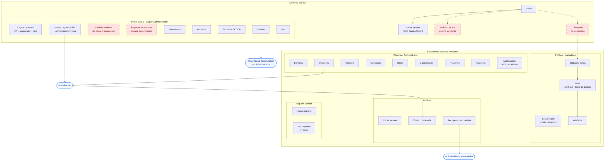
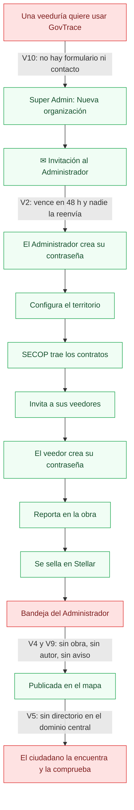
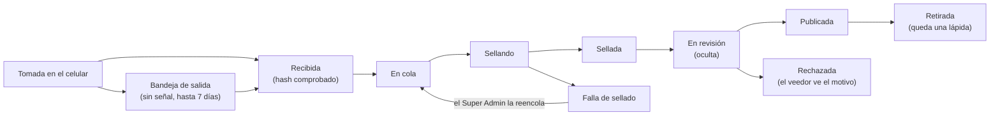

# Mapa funcional: pantallas y flujos por rol

Al 2026-09-29, sobre `main` en `7369d10`. Todas las pantallas de GovTrace y el recorrido de cada rol de punta a punta, para ver dónde se corta un flujo. Cada paso se comprobó en el código: rutas (`routes/web.php`, `routes/tenant.php`), pantallas (`resources/js/Pages`) y correos (`app/Domain/*/Notifications`).

✅ completo · ⚠️ a medias · ⬜ falta · ❓ decisión tuya · 🔴 corta el flujo · 🟠 lo deja a medias · 🟡 menor

## Resumen

**Lo que pidió la SPEC está completo:**
- las 56 historias, en 28 pantallas;
- de sus 66 reglas, 64 cumplidas; las otras 2 esperan producción (`specs/AUDIT.md`).

**Los vacíos están en lo que la SPEC no cubrió.** Recorriendo cada rol aparecen **17 vacíos**:
- **4 cortan un flujo** (🔴);
- **6 lo dejan a medias** (🟠);
- **7 son menores** (🟡).

**El registro de organizaciones que echaste de menos es una decisión, no un olvido.** US-001 dice que el Super Administrador da de alta cada organización "para habilitar su acceso de forma controlada y prevenir suplantaciones o spam". Lo que sí falta es el paso anterior: **cómo pide una veeduría que la den de alta.** Hoy no hay formulario ni contacto (V10).

| Rol | ¿Hace su trabajo de punta a punta? | Dónde se corta |
|---|---|---|
| Super Administrador | Casi | No puede salir. Tampoco puede asignar, reemplazar ni reinvitar al administrador de una organización. No puede reportar en nombre de una organización (hay regla, no pantalla) ni cambiar la razón social. |
| Administrador de Organización | Sí, en lo diario | No puede salir. Revisa evidencias sin ver de qué obra son ni quién las envió. No se entera cuando llegan nuevas. Es el único administrador, y nadie puede reemplazarlo. |
| Veedor de Campo | Sí | Volver a entrar: la app no se puede instalar, y el dominio central no lleva a su veeduría. No puede cambiar su contraseña con la sesión abierta. |
| Ciudadano | Sí, si ya tiene el enlace | El dominio central no lleva a ninguna veeduría. |

## 0. Quién es quién

**La organización no es una persona.** Es la entidad: una veeduría ciudadana (Ley 850 de 2003), una ONG o una cámara de comercio, con su NIT. En GovTrace es un espacio propio, un *tenant*, con su subdominio, su base de datos, su territorio y su mapa público. Dentro de ella trabajan personas con roles distintos.

La confusión es natural, porque en Colombia la organización se llama "veeduría" y sus miembros, "veedores". Pero son tres cosas distintas:
- **Organización:** la entidad, con NIT, subdominio y mapa.
- **Veedor:** una persona que pertenece a una organización y reporta desde las obras. Tiene cuenta, y entra porque el administrador de su organización lo invita.
- **Ciudadano:** cualquier persona, sin cuenta. Mira y comprueba. Para reportar, tiene que unirse a una veeduría como veedor.

```
GovTrace (la plataforma) ─────────── Super Administrador
 ├── Organización A (veeduría u ONG) ── a.govtrace…
 │    ├── Administrador
 │    ├── Veedores de campo (varios)
 │    └── Mapa público ────────────── Ciudadanos (sin cuenta)
 └── Organización B …
```

**Una analogía.** GovTrace funciona como una plataforma de periódicos:
- el Super Administrador es la empresa dueña de la plataforma: da de alta cada periódico, pero no escribe ni edita noticias;
- cada organización es un periódico;
- el Administrador es su editor: arma el equipo y decide qué se publica;
- el veedor es el reportero en la calle: trae la foto con la prueba de dónde y cuándo se tomó;
- el ciudadano es el lector, que además puede comprobar que la foto es auténtica.

### Super Administrador: opera la plataforma

Trabaja en el dominio central, en el "Panel global".
- **Da de alta cada organización** (US-001, US-002):
  - su NIT, validado con el dígito de verificación de la DIAN;
  - su nombre y su subdominio;
  - su Administrador inicial, que recibe la invitación por correo.
- **Gobierna las organizaciones:**
  - corrige el NIT a solicitud formal (US-011);
  - las suspende o reactiva: mientras están suspendidas, sus usuarios no entran y el mapa sigue visible con un aviso (US-003a);
  - las da de baja con doble confirmación: el mapa sale de línea y la evidencia se conserva 5 años (US-003b).
- **Opera el sistema:**
  - los parámetros globales: geocerca, vigencia de las invitaciones, hora de SECOP;
  - la salud de la sincronización con SECOP;
  - el sellado: el saldo de la cuenta que paga las comisiones, las fallas por reencolar y los costos por organización;
  - el uso de cada organización, la auditoría global y las alertas por correo.
- **No puede:**
  - tocar una evidencia sellada (R-SA-01);
  - crear reportes en una organización sin la autorización de su Administrador, que dura 30 días y queda registrada (R-SA-02).

### Administrador de Organización: dirige una veeduría

Trabaja en el subdominio de su organización, en el "Panel del Administrador".
- **Su equipo:** invita veedores por correo, reenvía o revoca invitaciones, y desactiva o reactiva cuentas (US-005, US-006, US-040-USR, US-041-USR).
- **Su territorio:** elige los municipios o departamentos que vigila, y GovTrace trae de SECOP II sus contratos de obra (US-012).
- **Sus obras:** los contratos, la ubicación de cada obra y los contratos agrupados en una misma obra (US-015, US-035, US-045-INT).
- **El control editorial, que es su tarea central** (US-036, US-037). Toda evidencia sellada llega oculta, y él decide:
  - publicarla: aparece en el mapa;
  - rechazarla con un motivo, que ve el veedor;
  - retirar una ya publicada: en el mapa queda una lápida.

  La organización responde por lo que muestra su mapa (R-MAP-01).
- **Además:** el nombre y el logo, el resumen del territorio, el CSV, la auditoría de su organización y la autorización al Super Administrador.
- **No puede:** crear otras organizaciones, cambiar el NIT ni alterar evidencias selladas (R-TA-01 a R-TA-03).

### Veedor de campo: el que va a la obra

Usa la app en el celular.
- **Entra por invitación:** crea su contraseña con el enlace del correo (US-030).
- **Reporta** (US-008, US-009, US-016, US-019):
  1. Elige la obra, buscándola o con "Obras cercanas", que usa el GPS.
  2. Dice qué vio: Avance, Retraso o Abandono.
  3. Si quiere, escribe un comentario.
  4. Adjunta de 1 a 5 fotos, o un PDF.
- **Mientras tanto, la app:**
  - toma la ubicación;
  - borra los metadatos de las fotos;
  - calcula la huella de cada archivo en el mismo teléfono;
  - si no hay señal, guarda el reporte y lo envía después, hasta 7 días (US-018).
- **Cada reporte se sella en Stellar.** GovTrace paga la comisión: el veedor nunca ve billeteras ni criptomonedas (R-BLK-01).
- **"Mis reportes":** si ya se selló, si lo publicaron o rechazaron (con el motivo) y su recibo (US-010, US-023).
- **No puede:** publicar, ver los reportes de otros veedores, gestionar usuarios ni ver costos (R-VC-01 a R-VC-03).
- Un mismo correo puede ser veedor en varias organizaciones, con una cuenta en cada una (R-USR-01).

### Ciudadano (Verificador Público): el que mira y comprueba

Es cualquier persona: un vecino, un periodista, un funcionario. No necesita cuenta (R-VER-02).
- **El mapa de obras de una veeduría**, con sus colores (verde normal, amarillo alerta, rojo en riesgo) y sus filtros (US-027, US-028).
- **La ficha de cada obra** (US-017, US-029):
  - los datos del contrato en SECOP: entidad, contratista, valor, plazo y enlace;
  - la línea de tiempo con las evidencias publicadas.
- **Comprobar una evidencia:**
  - el validador calcula la huella de una foto en su navegador, sin subirla, y la busca en Stellar (US-024, R-VER-01);
  - también están el recibo, la descarga con su prueba y el script independiente (US-025, US-026, US-046-INT).
- **Estadísticas y datos abiertos**, en CSV o JSON (US-051-RPT, US-052-RPT).
- **No puede reportar:** para eso tiene que ser veedor de una organización.

### El Sistema, que trabaja solo

- Trae los contratos de SECOP cada noche, y también cuando un administrador cambia su territorio.
- Marca en riesgo las obras vencidas.
- Sella con reintentos.
- Manda las alertas, archiva y hace los respaldos.

(US-013, US-020a, US-020b, US-021, US-032 a US-034, US-048-MNT.)

### Cómo encadenan los roles

1. El Super Administrador crea la organización.
2. Su Administrador arma el equipo y el territorio.
3. El veedor reporta desde la obra.
4. El sistema sella el reporte.
5. El Administrador lo revisa y lo publica.
6. El ciudadano lo ve en el mapa y lo comprueba.

## 1. El mapa de las interfaces

Las 28 pantallas, agrupadas por dominio y por rol. En rojo y punteado, lo que falta; en azul, los correos.



**Las pantallas, una por una:**

| Dominio | Pantalla | Ruta | Quién | Historias |
|---|---|---|---|---|
| Central | Inicio | `/` | Cualquiera | — |
| Central | Iniciar sesión, recuperar y restablecer contraseña | `/login`, `/forgot-password` | Super Admin | US-031, US-039-USR |
| Central | Organizaciones | `/admin/organizations` | Super Admin | US-001, US-003a, US-003b, US-011 |
| Central | Nueva organización | `/admin/organizations/new` | Super Admin | US-001, US-002 |
| Central | Parámetros | `/admin/parameters` | Super Admin | US-038-CFG |
| Central | Auditoría | `/admin/audit` | Super Admin | US-043-MON |
| Central | Salud de SECOP | `/admin/secop-health` | Super Admin | US-014 |
| Central | Sellado | `/admin/sealing` | Super Admin | US-004, US-022, US-047-MNT |
| Central | Uso | `/admin/usage` | Super Admin | US-053-RPT |
| Veeduría | Mapa de obras | `/` | Cualquiera | US-027, US-028 |
| Veeduría | Obra | `/worksite/{id}` | Cualquiera | US-017, US-025, US-026, US-029 |
| Veeduría | Estadísticas y datos abiertos | `/stats`, `/open-data.csv` | Cualquiera | US-051-RPT, US-052-RPT |
| Veeduría | Validador | `/verify` | Cualquiera | US-024 |
| Veeduría | Sin conexión | (la PWA) | Veedor | US-018 |
| Veeduría | Iniciar sesión, crear, recuperar y restablecer contraseña | `/login`, `/set-password/{id}` | Administrador, veedor | US-030, US-031, US-039-USR |
| Veeduría | Nuevo reporte | `/reports/new` | Veedor | US-008, US-009, US-016, US-018, US-019 |
| Veeduría | Mis reportes y recibo | `/my-reports` | Veedor | US-010, US-023 |
| Veeduría | Bandeja | `/admin/inbox` | Administrador | US-036, US-037 |
| Veeduría | Veedores | `/admin/observers` | Administrador | US-005, US-006, US-040-USR, US-041-USR |
| Veeduría | Territorio | `/admin/territory` | Administrador | US-012 |
| Veeduría | Contratos | `/admin/contracts` | Administrador | US-015 |
| Veeduría | Obras | `/admin/worksites` | Administrador | US-035, US-045-INT |
| Veeduría | Organización | `/admin/organization` | Administrador | US-007 |
| Veeduría | Resumen y CSV | `/admin/summary` | Administrador | US-049-RPT, US-050-RPT |
| Veeduría | Auditoría | `/admin/audit` | Administrador | US-043-MON |
| Veeduría | Autorización al Super Admin | `/admin/authorization` | Administrador | US-042-SEC |

**Los correos que salen:**
- la invitación: al Administrador inicial y a cada veedor;
- el enlace para restablecer la contraseña;
- las alertas:
  - al Super Administrador: saldo de la patrocinadora, organización sin actividad en 30 días y alertas críticas;
  - al Super Administrador y al Administrador afectado: cola de sellado estancada.

**Sin pantalla, a propósito:** el "Sistema" (US-013, US-020a, US-020b, US-021, US-032 a US-034 y US-048-MNT) corre solo. Se ve en Salud de SECOP, en Sellado y en los colores del mapa.

## 2. Los flujos de cada rol, de punta a punta

### Super Administrador

| # | Paso | Estado | Nota |
|---|---|---|---|
| 1 | Obtener acceso | ✅ | Por consola (`make admin`). No hay pantalla para crear otros Super Administradores, a propósito. |
| 2 | Entrar | ✅ | Dominio central, "¿Olvidó su contraseña?" incluido. El doble factor, ❓ (ya estaba en `docs/estado-mvp.md`). |
| 3 | Dar de alta una organización | ✅ | Nueva organización: NIT con dígito de verificación, subdominio y, si quiere, el Administrador inicial (US-001, US-002). |
| 4 | Acompañar al administrador hasta que active su cuenta | ⬜ 🔴 | **V2.** No ve si activó su cuenta ni puede reenviarle la invitación, que vence a las 48 h. Si el correo estaba mal escrito, o la organización se creó sin administrador, no hay cómo asignar uno después. La organización queda sin nadie que la gestione. |
| 5 | Reemplazar a un administrador que se va o actúa mal | ⬜ 🔴 | **V3.** No puede asignar otro ni desactivarlo: solo puede suspender la organización entera. |
| 6 | Gobernar | ⚠️ | Editar el NIT, suspender, reactivar y dar de baja (con doble confirmación): ✅. **V8:** la razón social no se puede cambiar, aunque US-011 la pide ("cambio de razón social o NIT"). |
| 7 | Operar | ✅ | Parámetros, auditoría, salud de SECOP, sellado (con reencolar las fallas), uso y alertas por correo. Sincronizar SECOP a mano no se puede (V15). |
| 8 | Reportar en nombre de una organización que lo autorizó | ⚠️ 🟠 | **V7.** La regla existe y está probada (US-042-SEC, R-SA-02), pero no hay pantalla: solo se puede por API. |
| 9 | Salir | ⬜ 🔴 | **V1.** Ni botón ni ruta de salida en el dominio central. |

### Administrador de Organización

| # | Paso | Estado | Nota |
|---|---|---|---|
| 1 | Recibir la invitación, crear su contraseña y entrar | ✅ | US-030 y US-031. Abre en la Bandeja. |
| 2 | Configurar el territorio | ✅ | US-012. Al guardar, SECOP trae los contratos enseguida, sin esperar a la noche. |
| 3 | Personalizar la organización | ✅ | Nombre de fantasía y logo (US-007). |
| 4 | Armar el equipo | ⚠️ | Invitar, reenviar, revocar, desactivar y reactivar veedores: ✅. **V3:** no puede sumar otro administrador. Un mismo correo no puede ser administrador y veedor en la misma organización, así que si el administrador también sale a campo necesita otro correo ❓. |
| 5 | Preparar las obras | ✅ | Contratos (US-015), corregir la ubicación (US-035) y agrupar contratos (US-045-INT). En Contratos no hay buscador (`docs/ux-analisis.md`). |
| 6 | Revisar y publicar | ⚠️ 🔴 | Publicar, rechazar con motivo y retirar con lápida: ✅. **V4:** la tarjeta no dice de qué obra es la evidencia, ni quién la envió. **V9:** no le llega ningún aviso de que hay evidencias por revisar. |
| 7 | Hacer seguimiento | ✅ | Resumen, CSV, auditoría y el aviso de fallas de sellado. |
| 8 | Autorizar al Super Administrador | ✅ | 30 días, revocable (US-042-SEC). |
| 9 | Salir | ⬜ 🔴 | **V1.** |

### Veedor de Campo

| # | Paso | Estado | Nota |
|---|---|---|---|
| 1 | Recibir la invitación, crear su contraseña y entrar | ✅ | Abre en Nuevo reporte. |
| 2 | Volver a entrar otro día | ⚠️ 🟠 | **V6.** Tiene que haber guardado el enlace de su veeduría. La app no se puede instalar: tiene service worker, pero le faltan el manifiesto y los íconos. Y el dominio central solo ofrece el acceso del Super Administrador (V5). |
| 3 | Reportar | ✅ | Buscar la obra u "Obras cercanas", GPS, fotos o PDF, sin señal y con límite por hora (US-008, US-009, US-016, US-018, US-019). |
| 4 | Saber qué pasó con su reporte | ✅ | Mis reportes, con el recibo y el motivo si fue rechazado (US-010, US-023). No le llega correo: lo ve al entrar (V17). |
| 5 | Su cuenta | ⚠️ 🟡 | Recuperar la contraseña: ✅. **V11:** no puede cambiarla con la sesión abierta. Su nombre sale del correo (deuda aceptada). |
| 6 | Salir | ✅ | Avisa si quedan reportes sin enviar. |

### Ciudadano (Verificador Público)

| # | Paso | Estado | Nota |
|---|---|---|---|
| 1 | Llegar a una veeduría | ⬜ 🟠 | **V5.** Desde el dominio central no hay forma: solo sirve el enlace directo de cada veeduría. |
| 2 | Ver el mapa y filtrarlo | ✅ | Por estado, municipio, fechas y presupuesto (US-027, US-028). No se puede buscar una obra por nombre (V12). |
| 3 | Ver una obra | ✅ | Datos del contrato con el enlace a SECOP (si SECOP lo trae), línea de tiempo y fotos (US-017, US-029). No dice el estado de la obra ni por qué (`docs/ux-analisis.md`). |
| 4 | Comprobar una evidencia | ✅ | Validador, recibo y descarga con prueba (US-024 a US-026). El validador no enlaza el script independiente del repositorio (US-046-INT, V14). |
| 5 | Estadísticas y datos abiertos | ✅ | US-051-RPT y US-052-RPT. |
| 6 | Contactar a la veeduría | ⬜ 🟡 | **V13 ❓.** Su página no tiene datos de contacto. |
| 7 | Leer la política de datos y los términos | ⬜ | ❓ Ley 1581 (ya estaba en `docs/estado-mvp.md`). |

## 3. Los flujos entre roles

### 3.1 De una veeduría interesada a su primera evidencia publicada



### 3.2 La vida de una evidencia

Este flujo está completo. Cada estado tiene quien lo mueva y se ve en alguna pantalla.



### 3.3 Una organización que se va

También está completo:
- **Suspenderla:** sus usuarios no entran, y el mapa sigue visible con un aviso. Se puede reactivar.
- **Darla de baja:** pide doble confirmación, el mapa sale de línea y la evidencia se conserva 5 años (US-003a, US-003b, it. 33).

## 4. Los vacíos, uno por uno

| # | Vacío | Rol | Sev. | Por qué pasa | Propuesta |
|---|---|---|---|---|---|
| V1 | No se puede cerrar sesión en los paneles, y el dominio central no tiene ruta de salida. | Admin, Super Admin | 🔴 | Omisión | Ya está en la **it. 40b**. |
| V2 | El Administrador inicial:<br>• si su invitación vence o el correo estaba mal, nadie la reenvía ni la corrige;<br>• si la organización se creó sin él, no se puede asignar después.<br>La organización queda sin quien la gestione. | Super Admin | 🔴 | US-002 dice "tras el alta (o en un paso consecutivo)"; se hizo solo en el alta. | En el panel global, cada organización muestra sus administradores y el estado de su invitación, con "Reenviar" y "Asignar administrador". |
| V3 | Un solo administrador, sin reemplazo posible. El Super Administrador solo puede suspender la organización entera. | Admin, Super Admin | 🔴 | Omisión | El Super Administrador asigna y desactiva administradores. ❓ ¿El administrador también puede invitar a otro? |
| V4 | La Bandeja no dice de qué obra es la evidencia ni quién la envió: el JSON trae `worksite_id`, pero no el nombre ni el autor. | Admin | 🔴 | US-036 pide "revisión responsable" sin nombrar los datos. | La obra (nombre y municipio) y el veedor en cada tarjeta. La obra ya está en la it. 40b; el veedor, ❓. |
| V5 | El dominio central no lleva a ninguna veeduría. El ciudadano no tiene cómo llegar, y el veedor que olvidó su enlace tampoco. | Ciudadano, veedor | 🟠 | Omisión (R-MAP-01 aísla los mapas; no prohíbe un directorio). | Un directorio de veedurías activas en el Inicio ❓, ya en la it. 40d. |
| V6 | La app del veedor no se puede instalar: hay service worker (`public/sw.js`), pero no hay manifiesto ni íconos. | Veedor | 🟠 | Omisión técnica | Un manifiesto por veeduría, con su nombre y su logo, los íconos y un "Instalar en el celular". |
| V7 | Reportar en nombre de una organización (US-042-SEC): la regla está en el backend y probada, pero no hay pantalla. | Super Admin | 🟠 | Se hizo la API, no la pantalla. | Desde la organización autorizada, en el panel global, un formulario de reporte. |
| V8 | La razón social no se puede cambiar: solo el NIT (`UpdateOrganizationLegalData`). | Super Admin | 🟠 | US-011 a medias. | Editar también el nombre legal, con la misma auditoría. |
| V9 | Ningún aviso al administrador cuando hay evidencias por revisar: quedan ocultas hasta que alguien entra. | Admin | 🟠 | No estaba en la SPEC. | ❓ Un correo diario con cuántas hay por revisar. |
| V10 | Una veeduría no tiene cómo pedir el alta: no hay formulario ni contacto. | Veeduría interesada | 🟠 | El alta controlada es a propósito (US-001). El canal para pedirla, no se definió. | ❓ Un formulario de solicitud en el Inicio que llega al Super Administrador. Él aprueba (la Nueva organización sale precargada) o rechaza con un motivo. No es autorregistro: se conserva el control. |
| V11 | No se puede cambiar la contraseña con la sesión abierta: solo con "¿Olvidó su contraseña?". | Todos | 🟡 | No estaba en la SPEC. | "Cambiar contraseña" en "Mi cuenta" (el menú de la it. 40c). |
| V12 | En el mapa público no se puede buscar una obra por su nombre. | Ciudadano | 🟡 | US-028 pide estado, presupuesto y municipio. | Un buscador junto a la lista de obras (it. 40c). |
| V13 | La página de la veeduría no tiene datos de contacto. | Ciudadano | 🟡 | US-007 solo pide nombre y logo. | ❓ Correo, teléfono o web en el perfil de la organización. |
| V14 | El validador no enlaza el script de verificación independiente. | Ciudadano experto | 🟡 | Omisión | Un enlace "Verificarlo por su cuenta" hacia `tools/verify`. |
| V15 | No se puede sincronizar SECOP a mano desde el panel global: corre cada noche y al cambiar un territorio. | Super Admin | 🟡 | US-014 solo pide ver la salud. | Un botón "Sincronizar ahora". |
| V16 | El Super Administrador no ve quién administra cada organización. | Super Admin | 🟡 | Omisión | Va con V2. |
| V17 | Al veedor no le llega correo cuando su reporte se publica o se rechaza: lo ve al entrar. | Veedor | 🟡 | No estaba en la SPEC. | ❓ Opcional. |

**Decidido así en el discovery, y no es un vacío:**
- **El autorregistro de organizaciones.** Es un alta controlada, contra la suplantación y el spam (US-001).
- **El ciudadano no se registra ni reporta.** Es un actor anónimo.
- **Nadie edita ni borra un reporte sellado.** Es la razón de ser del sello.
- **Las evidencias se publican de a una** (US-036).
- **Varias veedurías son varias cuentas** (R-USR-01).
- **El Super Administrador se crea por consola.**

## 5. Cómo cerrarlos

**Primero, el checkpoint base (it. 40a).** Estos flujos se vuelven tests de extremo a extremo, uno por rol y uno entre roles. Los pasos que hoy funcionan pasan. Cada vacío queda como un test pendiente con su número (`test.fixme('V2: …')`). Cada iteración que cierra un vacío lo pasa a verde, así que el avance se mide, no se promete (sección 6).

**Dentro de la it. 40, porque son pequeños y ya estaban:**
- V1: salir;
- V4: la obra en la Bandeja, y el autor si lo apruebas;
- V11 y V12: van con el menú y la lista de la 40c.

**El resto, en una iteración nueva: la it. 43, "Flujos completos".** Son historias nuevas o historias a medias. Según el marco, las nuevas pasan primero por un `/discovery` corto en modo asesor, con sus criterios y su Gherkin, antes de los tests. Se parte en dos:

- **43a — El gobierno de las organizaciones:**
  - V2, V3 y V16: los administradores de cada organización, con asignar, reenviar, reemplazar y desactivar;
  - V7: la pantalla para reportar en nombre de una organización;
  - V8: la razón social.

  Toca quién controla cada organización, es decir, el acceso. Según tu política de modelos, **Opus xhigh**.
- **43b — Llegar y volver:**
  - V6: la app instalable;
  - V10: la solicitud de alta;
  - V9: el aviso diario al administrador;
  - V13, V14 y V15.

  Salvo el formulario público de solicitud, que lleva límite de abuso, es trabajo de interfaz y de correo: **Sonnet medium**.

**Decisiones tuyas (❓):**
1. **La solicitud de alta (V10):** ¿un formulario que llega al Super Administrador (recomendado) o solo un correo de contacto?
2. **Los administradores (V3):** ¿puede haber varios por organización? ¿Los asigna solo el Super Administrador, o el administrador también puede invitar a otro?
3. **El autor en la Bandeja (V4):** ¿el administrador ve qué veedor envió cada evidencia? Recomiendo que sí: la autoría se conserva por regla, y es su equipo.
4. **El aviso diario (V9):** ¿un correo al administrador con las evidencias por revisar?
5. **El contacto de la veeduría (V13):** ¿se publican su correo, teléfono o web?
6. **El administrador que también reporta:** ¿se acepta que use otro correo, o se permite que un mismo correo tenga los dos roles en su organización?

## 6. ¿Probado pero sin interfaz?

La sospecha era que buena parte del código sirve para asegurar la calidad, y que hay cosas probadas que nunca llegaron a una pantalla. Medido:

**Casi todo lo probado tiene su pantalla.** De las rutas del backend, solo una no la tiene: `POST /admin/organizations/{tenant}/reports`, la de reportar en nombre de una organización (V7). Las demás:
- las llama alguna pantalla;
- van en un correo, como la invitación o el restablecer contraseña;
- o el backend las entrega dentro del JSON que usa la pantalla: fotos, descargas, pruebas y recibos.

**Los tests sí son más de la mitad del código, y eso es normal con TDD:**
- unas 20.500 líneas de tests (Pest, Vitest, Gherkin y E2E);
- unas 16.800 de aplicación (PHP, Vue y el contrato en Rust);
- más de 1.100 tests.

**Lo que falta es un nivel de prueba.** Cada test comprueba una historia sola. Solo 2 tests usan un navegador de verdad (la CSP y el modo sin conexión), y ninguno recorre el flujo completo de un rol. Por eso cada pieza funciona, pero nadie comprobó que las piezas encadenen:
- **Salir:** la ruta existe y está probada con el veedor, pero el panel del Administrador no tiene el botón.
- **Reportar en nombre de una organización:** la regla del Super Administrador está probada, pero le falta la pantalla.
- **La Bandeja:** recibe el número de la obra, pero no muestra cuál es.
- **La invitación del administrador:** funciona, pero nadie puede reenviarla.

**La respuesta no es tener menos tests, sino sumar ese nivel:** los flujos de la sección 2, como tests de extremo a extremo. Eso es el checkpoint base (it. 40a).

