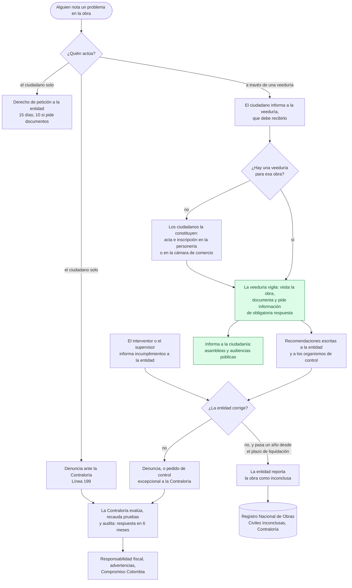

# El control social de una obra hoy, frente a GovTrace

**Revisión documental del 2026-09-30.** Para qué sirve: alinear la versión 1 con el proceso actual, ver cuánta diferencia hay y definir el alcance del MVP v1.

Cada afirmación sobre la ley cita su artículo; las fuentes están al final. Lo marcado ❓ está **por validar** con personas: una veeduría, un veedor, una personería y la Contraloría (§7). Esto no es asesoría legal: antes de construir sobre una norma, conviene que un abogado la confirme.

## Resumen

1. **El ciudadano, solo, ya es un actor del control social.** La ley lo define como "el derecho y el deber de los ciudadanos a participar de manera individual o a través de sus organizaciones" (Ley 1757 de 2015, art. 60). Una denuncia ante la Contraloría "podrá ser presentada por las veedurías o por cualquier ciudadano" (art. 69). En GovTrace, el ciudadano solo mira.
2. **Toda veeduría tiene el deber de recibir lo que le informen los ciudadanos** sobre las obras que vigila (Ley 850 de 2003, arts. 15 e) y 18 a)). GovTrace no tiene ese canal.
3. **Una veeduría se constituye con un acta** que nombra a sus veedores, su objeto, su territorio y su duración, y se inscribe en la personería o en la cámara de comercio (Ley 850, art. 3). GovTrace modela otra cosa: una organización permanente que vigila un territorio, cuyos veedores invita el Administrador.
4. **Ser veedor tiene impedimentos legales**: por ejemplo, ser contratista o interventor de la obra, o pariente de ellos (Ley 850, art. 19). GovTrace no los pregunta.
5. **La vigilancia desemboca en actos formales:** derechos de petición, recomendaciones escritas, informes a las autoridades, denuncias y audiencias públicas (Ley 850, arts. 15 y 16). **GovTrace termina en "publicado en el mapa"**, un paso antes de ese proceso.
6. **"Obra inconclusa" tiene definición legal y un registro oficial** que administra la Contraloría: la obra que, un año después de vencido el plazo de liquidación, no se terminó (Ley 2020 de 2020). El "En riesgo" de GovTrace es otra cosa: una alerta temprana propia. No se cruza con ese registro.

**Lo que GovTrace ya hace bien, y el proceso no tiene:** evidencia con fecha, lugar y un sello que cualquiera puede verificar. La Contraloría, al atender una denuncia, hace "recaudo de pruebas" (Ley 1757, art. 70). Es probable que ahí esté el mayor valor de GovTrace ❓.

## 1. El marco

| Norma | Qué establece | Qué le importa a GovTrace |
|---|---|---|
| **Ley 850 de 2003** (veedurías ciudadanas) | Art. 1: la veeduría vigila la gestión pública donde haya recursos públicos. Las entidades que ejecutan un contrato deben informar a la ciudadanía para que lo vigile. | Es la ley central de nuestro dominio. |
| | Art. 2: la constituyen "todos los ciudadanos en forma plural o a través de organizaciones civiles". | Cualquier grupo de ciudadanos puede formar una. |
| | Art. 3: los veedores se eligen de forma democrática. Un **acta de constitución** fija integrantes, documento de identidad, objeto de la vigilancia, nivel territorial, duración y residencia. Se **inscribe** en la personería o en la cámara de comercio, que llevan un registro público. | Los veedores de una veeduría son los de su acta. |
| | Art. 4: la vigilancia es "preventiva y posterior", con "recomendaciones escritas y oportunas" ante las entidades y los organismos de control. | La salida de la vigilancia es escrita y formal. |
| | Art. 15: funciones. Entre ellas: d) vigilar la ejecución y calidad técnica de las obras; e) **recibir los informes, observaciones y sugerencias de los ciudadanos**; f) pedir informes a interventores, supervisores, contratistas y entidades; g) comunicar los avances a la ciudadanía; h) remitir informes a las autoridades; i) denunciar. | Hoy GovTrace cubre d) y, en parte, g). |
| | Art. 16: instrumentos. Derechos de petición, acciones judiciales, audiencias públicas, denuncias y el pedido a la Contraloría General de un **control excepcional**. | Es lo que la veeduría hace con su evidencia. |
| | Art. 17 c): la información que pide una veeduría "es de obligatoria respuesta". | — |
| | Art. 18: deberes. a) recibir lo que informen los particulares; b) comunicar avances en asambleas; e) inscribirse; f) audiencias públicas para rendir informes. | — |
| | Art. 19: **impedimentos para ser veedor**: contratistas, interventores, proveedores o trabajadores de la obra (o del año anterior); sus parientes; funcionarios relacionados; ediles, concejales, diputados y congresistas. | GovTrace no los verifica. |
| | Art. 20: la veeduría no puede, por sí sola, "retrasar, impedir o suspender" la obra. | GovTrace no hace nada de eso. |
| | Art. 21: las veedurías pueden formar redes. Art. 22: la **red institucional de apoyo** (Procuraduría, Contraloría, Defensoría, Ministerio del Interior, Función Pública y ESAP). | — |
| **Ley 1757 de 2015** (participación democrática) | Art. 60: el control social es individual u organizado. Art. 63: se ejerce por veedurías, juntas de vigilancia, auditorías ciudadanas y otras instancias. | La veeduría no es la única forma. |
| | Art. 65: las entidades deben garantizar el control social y entregar la información. | — |
| | Art. 69: la denuncia ante los organismos de control fiscal la presentan "las veedurías o cualquier ciudadano". | — |
| | Art. 70: el trámite es evaluación, atención inicial y **recaudo de pruebas**, traslado a auditoría y respuesta. En el proceso auditor, la respuesta definitiva llega en **6 meses**. | Aquí entra la evidencia. |
| **Ley 1755 de 2015** (derecho de petición) | Art. 14: se responde en **15 días**. Si pide documentos o información, en **10**. Si no hay respuesta, se entiende aceptada y las copias se entregan en 3 días. | Plazos que la app podría seguir. |
| **Ley 1474 de 2011** (Estatuto Anticorrupción) | Arts. 83 y 84: la entidad vigila la ejecución con un **supervisor o un interventor**, que debe informarle de incumplimientos o riesgos. | El interventor es la primera línea, y en GovTrace no es un actor. |
| **Ley 2020 de 2020** (obras inconclusas) | Art. 2: define la **obra civil inconclusa**. Art. 3: la Contraloría (su Dirección de Información, Análisis y Reacción Inmediata) administra el **Registro Nacional**, que alimentan las entidades. | — |
| | Art. 8: el registro "será público bajo los criterios y condiciones que establezca el Contralor", y la Contraloría "establecerá los canales" para que la ciudadanía "advierta la existencia de obras civiles inconclusas". | Existe un canal ciudadano oficial. |
| **Acto Legislativo 04 de 2019 y Decreto Ley 403 de 2020** | Además del control fiscal posterior y selectivo, la Contraloría ejerce un control **preventivo y concomitante**, mientras la obra se ejecuta. | La evidencia en tiempo real le sirve. ❓ |

**La práctica, según la Contraloría** (Portafolio, 18 de noviembre de 2024):
- entre 2023 y 2024 gestionó más de 2.257 denuncias fiscales;
- identificó 1.468 "elefantes blancos" y proyectos críticos;
- con la estrategia "Compromiso Colombia", puso en funcionamiento 141 obras;
- recibe denuncias por la **Línea 199** y tiene el sistema **SIPAR** ❓ (su alcance, por validar).

## 2. Los actores reales

| Actor | Qué hace hoy | En GovTrace |
|---|---|---|
| **Ciudadano** | Ejerce control social por sí solo (1757, art. 60). Informa a una veeduría (850, art. 18 a)). Presenta derechos de petición (1755). Denuncia ante la Contraloría (1757, art. 69; Línea 199). | "Verificador Público": sin cuenta, **solo mira** y verifica. |
| **Veeduría** | Se constituye por acta y se inscribe (850, art. 3). Tiene objeto, territorio y duración: a veces una sola obra ❓. Pide información, vigila, recomienda, informa y denuncia (arts. 15 y 16). | "Organización": tenant permanente, con territorio de DIVIPOLA. Se da de alta con NIT (US-001). |
| **Veedor** | Integrante de la veeduría, elegido y nombrado en su acta (art. 3), sin impedimentos (art. 19). | "Veedor de Campo": lo invita el Administrador, sin preguntar impedimentos. |
| **Red de veedurías** | Coordina a varias (art. 21). | No existe. |
| **Entidad contratante y su supervisor** | Vigila la ejecución (1474, art. 83). Responde peticiones (1755). Debe informar a la ciudadanía (850, art. 1). Reporta sus obras inconclusas (2020, art. 3). | Solo su nombre, desde SECOP II. |
| **Interventor** | Vigila y debe informar incumplimientos a la entidad (1474, art. 84). La veeduría puede pedirle informes (850, art. 15 f)). | Aparece como un contrato más. La demostración agrupa una interventoría con su obra. |
| **Contratista** | Ejecuta la obra. | Su nombre, desde SECOP II. |
| **Personería o cámara de comercio** | Inscribe veedurías y lleva su registro público (850, art. 3). | No existe. El SPEC menciona una cámara de comercio como posible tenant. |
| **Contraloría General y contralorías territoriales** | Control fiscal. Atienden denuncias (1757, arts. 69 y 70). Llevan el Registro de obras inconclusas (2020). Ejercen el control excepcional (850, art. 16 d)). | No existe. |
| **Procuraduría, Defensoría, Ministerio del Interior, Función Pública y ESAP** | La red institucional de apoyo (850, art. 22). | No existe. |

## 3. El proceso de hoy, de punta a punta

En verde, lo que GovTrace cubre hoy: documentar en la obra (la evidencia sellada) y comunicar a la ciudadanía (el mapa). Todo lo demás pasa fuera de la app.

## 4. GovTrace v1 frente al proceso

| # | Tema | El proceso de hoy | GovTrace v1 | Brecha |
|---|---|---|---|---|
| B1 | **El ciudadano** | Actor legal por sí solo: informa, pide y denuncia. | Solo mira. | **Alta.** El modelo cerrado del SPEC choca con la Ley 1757, art. 60. |
| B2 | **Del ciudadano a la veeduría** | La veeduría debe recibir lo que el ciudadano le informe. | No hay canal. | **Alta.** Es un deber legal de nuestro propio cliente. |
| B3 | **La salida formal** | Peticiones, recomendaciones escritas, informes, denuncias y audiencias. | Termina en el mapa público. | **Alta.** La evidencia no llega al proceso que la usaría. |
| B4 | **Qué es una veeduría** | Acta con objeto, territorio y duración, inscrita en la personería o la cámara. A veces, una sola obra ❓. | Tenant permanente con territorio. Alta con NIT y dígito de verificación. | **Media.** ❓ ¿Tiene NIT una veeduría inscrita por ciudadanos? Si no, US-001 deja fuera a las veedurías de base. |
| B5 | **Quién es veedor** | Elegido y nombrado en el acta, sin impedimentos. | Invitado por el Administrador. | **Media.** Faltan los impedimentos del art. 19. Nuestro "veedor" puede ser un colaborador que no figura en el acta ❓. |
| B6 | **"Obra inconclusa"** | Definición legal y registro oficial de la Contraloría. | "En riesgo": desde el primer día de vencido el plazo, si sigue en ejecución, o si la última evidencia publicada dice Abandono. | **Media.** Dos conceptos distintos con nombres que se confunden. No se cruzan. |
| B7 | **Pedir información** | Obligatoria respuesta, en 10 o 15 días. | No existe. | **Media.** |
| B8 | **Interventor y supervisor** | La primera línea de la vigilancia. | No son actores. | **Baja.** Se puede pedir su informe con una petición (B7). |
| B9 | **Comunicar avances** | Asambleas y audiencias públicas. | El mapa, la línea de tiempo, las estadísticas y los datos abiertos. | **Cubierto en parte.** Es una fortaleza. |
| B10 | **La evidencia** | "Recaudo de pruebas", sin un estándar para la evidencia ciudadana ❓. | Fecha, lugar y sello verificables por cualquiera. | **Es la ventaja de GovTrace.** Falta saber si la Contraloría la acepta y en qué formato ❓. |

## 5. Qué corregir y alinear

### Para la v1 (poco costo, mucho alineamiento)

| # | Corrección | Cierra | Tamaño |
|---|---|---|---|
| A1 ✅ it. 44a | **Llamar las cosas por su nombre.** "En riesgo" se explica como una alerta de GovTrace, no como "obra inconclusa". En la obra: "¿Cree que es una obra inconclusa? Avísele a la Contraloría", con la Línea 199 y su canal (Ley 2020, art. 8). | B6 y B1, en parte | Pequeño |
| A2 | **"Informar a esta veeduría."** Un botón en la obra pública. El ciudadano, con su correo verificado, deja un texto y una foto opcional. La veeduría lo recibe en su panel como "informe ciudadano". Es su deber (Ley 850, art. 18 a)). **No se sella ni se publica**, así que no gasta XLM. La veeduría decide si manda a un veedor. Es la puerta "alertar" de `specs/V2-CIUDADANO.md`, adelantada y con base legal. | B2 y B1 | Mediano |
| A3 ✅ it. 44b | **El paquete de evidencia para el proceso formal.** Desde una obra, la veeduría descarga un expediente: los datos del contrato en SECOP, sus evidencias publicadas, sus recibos y pruebas y el enlace al verificador. Viene con plantillas de derecho de petición a la entidad y de denuncia ante la Contraloría, que presenta ella. | B3 y B10 | Mediano |
| A4 ✅ it. 44c | **Los impedimentos del veedor.** Al activar su cuenta, el veedor declara que no está en ninguno de los casos del art. 19. La declaración queda en el log de auditoría. | B5 | Pequeño |
| A5 ✅ it. 44d | **Los datos legales de la veeduría:** su inscripción (personería o cámara, número y fecha), su objeto y su duración. Y el NIT, **opcional** si se confirma que una veeduría de base no lo tiene ❓. | B4 | Pequeño a mediano |

### Para la v1 si cabe, o la v1.1

- **A6 — Seguir los plazos.** Cada petición presentada, con su vencimiento a 10 o 15 días. Cada denuncia, con su plazo de 6 meses.
- **A7 — Cruzar con el Registro Nacional de Obras Civiles Inconclusas**, si la Contraloría lo publica en datos abiertos ❓. Una obra reportada por su entidad lo diría en su ficha.
- **A8 — El informe de la veeduría** para sus asambleas y audiencias (art. 18 b) y f)), a partir de sus evidencias. La página de estadísticas es el comienzo.

### Para la V2

- **Constituir una veeduría para una obra**, con el acta lista para inscribir en la personería. Es la respuesta legal a "¿y si no hay veeduría?": los ciudadanos pueden formarla (Ley 850, arts. 2 y 3).
- **Postularse como veedor** de una veeduría existente.
- **La evidencia ciudadana sellada**, por lotes (`specs/V2-CIUDADANO.md`).
- **Escalar lo que nadie atiende** y una capa nacional, en municipios sin veeduría en GovTrace.

## 6. Propuesta de alcance del MVP v1

**Entra:** lo que ya está construido, más A1 a A5.
- Lo construido: el mapa, la evidencia sellada, el validador, los paneles de los tres roles y la operación.
- A1 a A5 son unas **cuatro iteraciones**:
  - A1 y A4 juntas, pequeñas;
  - A2;
  - A3;
  - A5, que depende de lo que se valide sobre el NIT.
- Con ellas, GovTrace cumple en la app los deberes legales básicos de su cliente, la veeduría, y entrega su evidencia al proceso que la usa.

**No entra** (sube el alcance sin cambiar el núcleo):
- constituir veedurías y postularse como veedor;
- la evidencia ciudadana sellada;
- la capa nacional;
- el seguimiento de plazos (A6);
- el cruce con el registro (A7);
- el informe para audiencias (A8).

**Cambia el SPEC.** El "modelo cerrado" se matiza: el ciudadano no aporta evidencia sellada, pero sí informa a la veeduría (A2). Ese cambio, y cada corrección, se hace con su `/discovery`: historias, criterios y `.feature`, como cualquier otra.

**Decisiones para el usuario ❓:**
1. ¿A1 a A5 entran en el MVP v1?
2. ¿A2 pide correo verificado, o nada? La recomendación es correo verificado: sin él no hay forma de frenar el spam, y el ciudadano sigue sin ser público.
3. ¿A3 genera las plantillas, o solo el expediente?
4. ¿Se valida con personas (§7) **antes** de A5, que depende de lo que tengan las veedurías reales?

## 7. Lo que hay que validar con personas

**Con una veeduría (idealmente, una que haya seguido una obra):**
- ¿Cómo se constituyó? ¿Para una obra o para un territorio? ¿Por cuánto tiempo?
- ¿Tiene NIT? ¿Dónde está inscrita?
- ¿Cómo le llegan hoy los avisos de los ciudadanos? ¿Qué hace con ellos?
- ¿Qué documentos presenta? ¿Peticiones, denuncias? ¿Le responden a tiempo?
- ¿Qué le serviría del expediente de A3? ¿Qué le sobra?

**Con un veedor:**
- ¿Cómo documenta una visita hoy? ¿Qué se pierde en el camino?
- ¿Los que salen a campo son los mismos que figuran en el acta?

**Con una personería:**
- ¿Qué pide para inscribir una veeduría?
- ¿El registro es público y consultable?
- ¿Cuántas se forman para una sola obra?

**Con la Contraloría** (Delegada para la Participación Ciudadana, o una gerencia departamental):
- ¿Qué necesita una denuncia para que se actúe: formato, fecha, lugar, fotos, cadena de custodia?
- ¿Una evidencia sellada en una red pública, verificable por cualquiera, tiene valor para ustedes?
- ¿El Registro Nacional de Obras Civiles Inconclusas se publica? ¿En datos abiertos?
- ¿Qué canal es el oficial para que un ciudadano advierta una obra inconclusa (Ley 2020, art. 8)?

**Con una entidad contratante o un interventor:**
- ¿Qué publican de la ejecución en SECOP II: informes de supervisión, actas?
- ¿Cómo responden a una veeduría?

## 8. Qué cambia en otros documentos

- **`specs/V2-CIUDADANO.md`** queda **en espera**. Sus "puertas" ya tienen base legal:
  - informar a la veeduría (Ley 850, art. 18 a));
  - denunciar (Ley 1757, art. 69);
  - constituir una veeduría (Ley 850, arts. 2 y 3);
  - los impedimentos (art. 19).

  El sellado por lotes sigue siendo la respuesta para el presupuesto, si en la V2 el ciudadano aporta evidencia sellada.
- **`specs/SPEC.md`:** el modelo de participación y los actores cambian cuando el `/discovery` lo confirme.
- **`docs/mapa-funcional.md` §0**, "Quién es quién", se actualiza con los actores de §2.

## Fuentes

- [Ley 850 de 2003, texto (ANI)](https://www.ani.gov.co/sites/default/files/ley_850_2003.pdf) y [en el Gestor Normativo de Función Pública](https://www.funcionpublica.gov.co/eva/gestornormativo/norma.php?i=10570)
- [Ley 1757 de 2015, texto (normograma de la Cancillería)](https://www.cancilleria.gov.co/sites/default/files/Normograma/docs/ley_1757_2015.htm)
- [Ley 2020 de 2020, Registro Nacional de Obras Civiles Inconclusas (encolombia)](https://encolombia.com/derecho/leyes/obras-inconclusas/)
- [Ley 1755 de 2015, derecho de petición](https://www.saludcapital.gov.co/Normo/jur/ley_1755_de_2015.pdf)
- [Ley 1474 de 2011, supervisión e interventoría (Función Pública)](https://www.funcionpublica.gov.co/eva/gerentes/Modulo4/tema-2/3-supervision.html)
- [Decreto Ley 403 de 2020, control fiscal (Rama Judicial)](https://sidn.ramajudicial.gov.co/SIDN/NORMATIVA/TEXTOS_COMPLETOS/5_DECRETOS/DECRETOS%202020/DECRETO%20403%20DE%202020%20(IMPLEMENTACI%C3%93N%20DEL%20ACTO%20LEGISLATIVO%204%20DE%202019%20PARA%20FORTALECER%20EL%20CONTROL%20FISCAL).PDF)
- [Por denuncias, la Contraloría identificó 1.468 elefantes blancos (Portafolio, 2024)](https://www.portafolio.co/economia/gobierno/por-denuncias-contraloria-identifico-1-468-elefantes-blancos-y-proyectos-criticos-617723)
- [Colombia Compra Eficiente, control social](https://www.colombiacompra.gov.co/transparencia/control-social)
